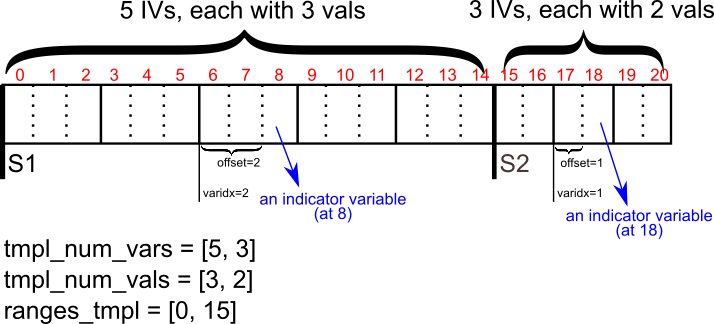

# GraphSPN

* `tbm`: Code for template-based method for graph modeling using SPN (i.e. GraphSPN).

* `tests`: Code for experiments with GraphSPN and Markov-Random Fields.

TODO: Need to fix import paths; Previously the package name was `spn_topo`. Now want to change it to `graphspn`.

## How the template SPN duplication works

See code:
* [`mod_compute_graph_up`](spn_model.py#L243) Modified the same function in `libspn`.
* [`TemplateSpn._dup_fun_up`](tbm/spn_template.py#L196) Function that computes a value for each node, given the inputs to that node (if any). Used to duplicate Sum, Product and Weights nodes, and (_most importantly_) constructing an input (Concat, indices), where Concat is the Concat node on the instance SPN, and indices are computed by converting the indices in the Concat node of the template SPN (being duplicated) to those in the Concat node of the instance SPN.
* [`TemplateSpn.duplicate_template_spns`](tbm/spn_template.py#L243) Given a `supergraph` which is the graph resulting from partitioning the original graph, as well as necessary template SPNs where each corresponds to a template used in the partition process, duplicate the template SPNs to cover the whole graph. This function helps `_dup_fun_up` to compute the appropriate indices for the instance SPN.

### How the indices for the instance SPN Concat node are computed

In order for this to work, we assume that in the instance SPN:
* There is a single Concat node that connects all inputs into the network. The inputs could be IVs, or the substructure rooted by a Product node that connects an indicator with a likelihood value.

Because there could be different types of IVs, for example, an IVs for place categories or an IVs for view, with different settings for `num_vars` and `num_vals`, both the template SPN and instance SPN are assumed to arrange these IVs in the following way

Additionally, one can specify the variable labels from the full graph (upon which instance SPN is constructed) by
setting the `labels` argument in `_dup_fun_up` so that the template uses inputs from those variables. This is essentially
_locating_ the template on the full graph:

